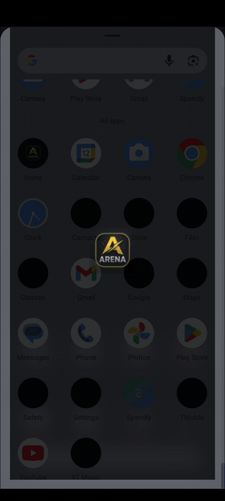
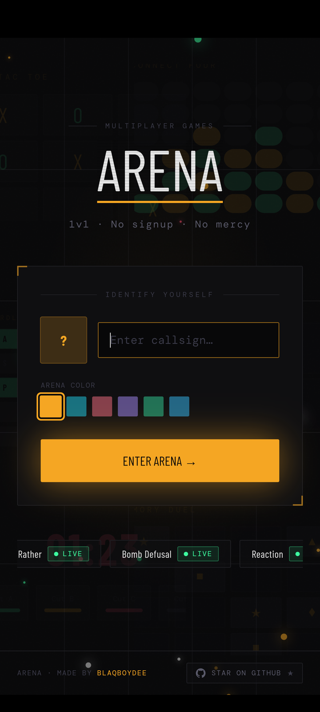
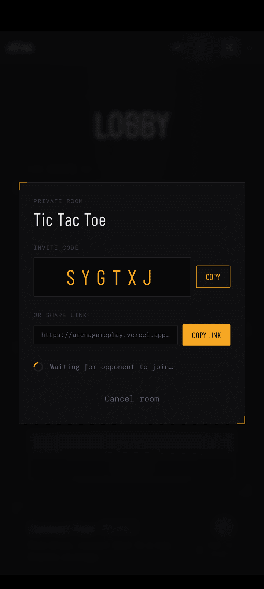
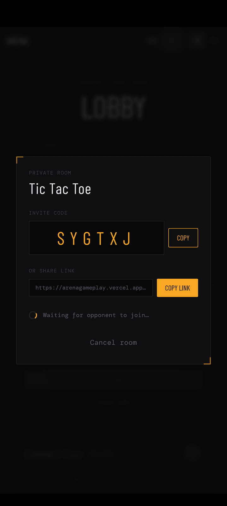

# Arena ⚡

**Real-time 1v1 multiplayer gaming hub** — create a private room, send the invite link, and battle your friends. No signup, no mercy.

👉 **[Play now: arenagameplay.vercel.app](https://arenagameplay.vercel.app/)**
📱 **[Download the Android app (arena.apk)](https://github.com/Blaqboydee/Arena-Frontend/releases/latest)**

<p align="center">
  
</p>

---

## 🎮 Games

| | | |
|---|---|---|
| ⚡ Reaction | ❌ Tic Tac Toe | 🪢 Hangman |
| 🟡 Connect Four | 🟩 Wordle Duel | 🧠 Memory Duel |
| 🏆 Trivia Royale | 💣 Bomb Defusal | 🤔 Would You Rather |

## ✨ Features

- ✅ **Real-time multiplayer** over Socket.io — moves land instantly
- ✅ **No signup** — pick a callsign and an avatar color, you're in
- ✅ **Private rooms** — invite code + shareable join link (`/join/:code`)
- ✅ **Quick match** — queue up against the next player in the lobby
- ✅ **Live connection badge** — see server state at a glance (Render cold starts handled gracefully)
- ✅ **Shareable result cards** — flex your wins as images
- ✅ Dark, arcade-style UI (Tailwind + Barlow Condensed)

## 📸 Screenshots

| Splash | Landing | Lobby | Private Room |
|--------|---------|-------|--------------|
|  |  |  |  |

---

## 📱 Android App (Capacitor)

Arena ships as a **native Android app** built from this same codebase with [Capacitor](https://capacitorjs.com/) — one React codebase, deployed to web and mobile.

**Native features:**

- ✅ Hardware back button — navigates between pages, minimizes from home (like a native app)
- ✅ Adaptive app icon + branded dark splash screen
- ✅ Connects to the same live server as the web app — play against web players from your phone
- ✅ Socket reconnects automatically after backgrounding/resuming the app

**📥 Download:** grab `arena.apk` from the [latest release](https://github.com/Blaqboydee/Arena-Frontend/releases/latest) and install it on any Android device.

**Build it yourself:**

```bash
npm install
npm run android:apk      # builds web app, syncs, and assembles the APK
# output: android/app/build/outputs/apk/debug/arena.apk
```

> Requires JDK 21 and the Android SDK (set `sdk.dir` in `android/local.properties`).

---

## 🛠 Tech Stack

- **React + TypeScript + Vite** — frontend
- **Socket.io** — real-time game state ([backend repo](https://github.com/Blaqboydee/arena--backend))
- **Tailwind CSS** — styling
- **Capacitor** — native Android packaging
- **Vercel** (client) + **Render** (server) — deployment

---

## ⚡ Run locally

```bash
git clone https://github.com/Blaqboydee/Arena-Frontend.git
cd Arena-Frontend
npm install
npm run dev      # expects the backend on localhost:3000 (see vite.config.ts proxy)
```

---

## 🗺 Future Improvements

- 📳 Haptic feedback on game events
- 🔔 Push notifications for game invites
- 🏪 Play Store release
- 🍎 iOS version
